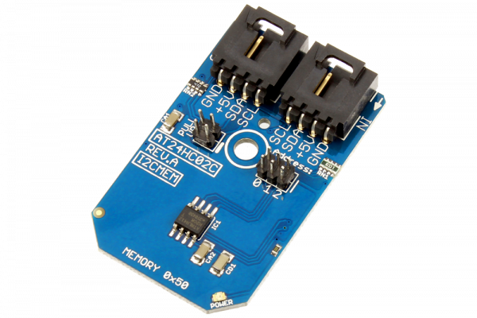

[](https://store.ncd.io/product/at24hc02c-256-byte-eeprom-i2c-mini-module/).

# AT24HC02C

Atmel’s AT24HC02C provides 2048-bits of Serial Electrically Erasable and Programmable Read-Only Memory (EEPROM) organized as 256 words of eight bits each. These devices are optimized for use in many industrial and commercial applications where low power and low voltage operation are essential.
This Device is available from www.ncd.io

[SKU: AT24HC02C]

(https://store.ncd.io/product/at24hc02c-256-byte-eeprom-i2c-mini-module/)
This Sample code can be used with Raspberry Pi.

Hardware needed to interface AT24HC02 3Axis Accelometer With Raspberry Pi :

1. <a href="https://store.ncd.io/product/at24hc02c-256-byte-eeprom-i2c-mini-module/">AT24HC02C 256Byte EEPROM</a>

2. <a href="https://store.ncd.io/product/i2c-shield-for-raspberry-pi-3-pi2-with-outward-facing-i2c-port-terminates-over-hdmi-port/">Raspberry Pi I2C Shield</a>

3. <a href="https://store.ncd.io/product/i%C2%B2c-cable/">I2C Cable</a>

## Python

Download and install smbus library on Raspberry pi. Steps to install smbus are provided at:

https://pypi.python.org/pypi/smbus-cffi/0.5.1

Download (or git pull) the code in pi. Run the program.

```cpp
$> python AT24HC02C.py
```
The lib is a sample library, you will need to calibrate the sensor according to your application requirement.
